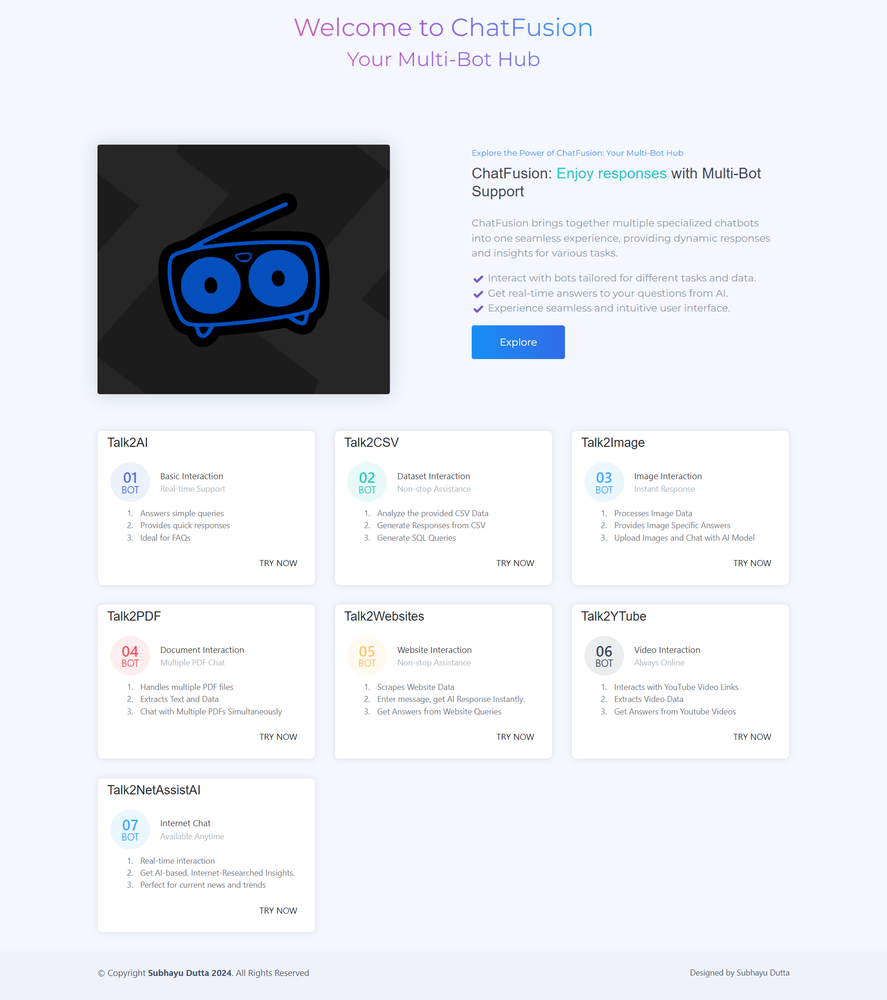

# ChatFusion
ChatFusion brings together multiple specialized chatbots into one seamless experience, providing dynamic responses and insights for various tasks.

Visit the live app: [ChatFusion](https://chat-fusion-rose.vercel.app/)

## Features

- Talk2AI provides basic interaction by answering queries quickly, making it ideal for FAQs. 

- Talk2CSV focuses on dataset interaction, offering features to analyze CSV data and generate responses and SQL queries.

- Talk2Image specializes in image interaction, processing image data and providing specific answers, including the ability to upload images for AI interaction. 

- Talk2PDF facilitates document interaction, handling multiple PDF files and extracting text and data while enabling simultaneous chat with multiple PDFs. 

- Talk2Websites engages in website interaction, scraping data and providing instant AI responses to queries. 

- Talk2YTube, centered on video interaction, interacts with YouTube links to extract and analyze video data. 

- Talk2NetAssistAI offers internet chat, delivering real-time AI-based insights perfect for current news and trends.

## Technologies Used:
- LangChain
- Streamlit
- Google Generative AI
- Faiss
- YouTubeTranscriptApi
- Beautiful Soup
- PyPDF2
- Flask

## Installation:
1. Clone the repository: `git clone https://github.com/subhayudutta/ChatFusion.git`
2. Navigate to the project directory: `cd ChatFusion`
3. Install dependencies: `pip install -r requirements.txt`

## Usage:
1. Run the flask app: `python app.py`
2. Access the app in your browser at `http://localhost:8501`

## Usage:
1. Open the app in your browser.
2. Enter your Gemini API key if you have one.
3. Adjust the temperature setting using the sidebar slider.
4. Select the desired GEMINI model from the dropdown menu.
5. Start chatting!

## Configure the following settings in the sidebar:
1. Gemini API Key: Enter your Gemini API key for AI model access.
2. Temperature: Adjust the temperature slider for response generation.
3. Model Selection: Choose the appropriate AI model for data analysis.

## Contribution:
Contributions are welcome! Feel free to open an issue or submit a pull request.

## License:
This project is licensed under the [GPL-3.0 license](LICENSE).
Feel free to customize the README according to your project's specifics!